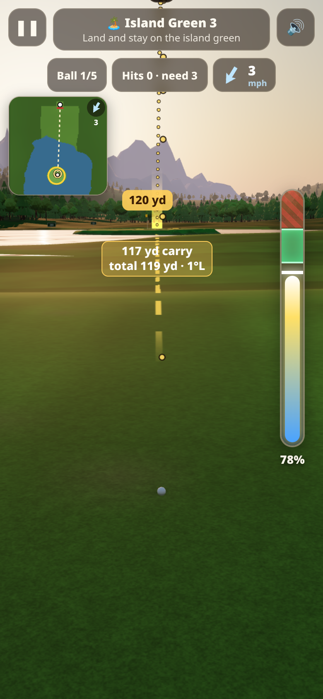
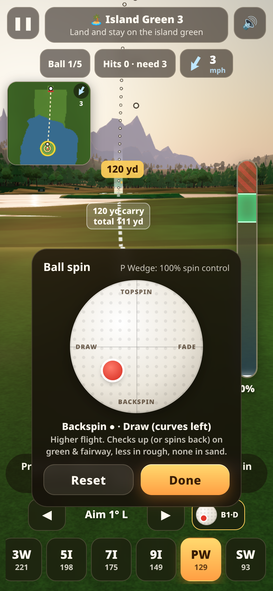

# Golden Hour Golf · Driving Range Challenge

Mobile-first 3D golf driving-range game (Three.js r169, no build step). Play: https://ryanweary.github.io/golf-challenge/

**Swing:** press & hold anywhere to charge (meter rises and falls), slide your thumb left/right while holding to aim (live aim line + landing zone), release in the green sweet spot. Early = weak slice, late/overswing = hook. Drag down while holding to cancel. Pick a club from the bottom row; tap during flight to fast-forward.

**Career:** Longest Drive (10), Target Greens (10), Crosswind (10), Island Green (8), Obstacle Shots (8), Tour Championship (6 multi-stage events). 1–3 stars per level, progress saved in localStorage.

## New: landing prediction, spin, minimap & music
- **Landing prediction** – before and during the swing, a gold ring marks where a clean strike lands, a faint white ring marks where it stops after rolling, and a dotted arc traces the flight. It uses the same physics as the real shot, including club, live meter power, aim, wind and spin. The label shows carry and total yards. Later levels show only the carry ring and a shorter arc.
- **Spin** – tap the golf-ball button next to the aim arrows. Tap or drag the red dot: up = topspin (lower flight, more roll), down = backspin (higher flight, checks up or spins back on greens and fairway, less in rough, none in sand), left/right = draw/fade. Wedges allow the most spin and the driver the least.
- **Minimap** – a top-down map at top-left shows the hole, targets, wind, the predicted path, landing and stop points, and the live ball in flight. Tap it to enlarge.
- **Music** – generated ambient pads that start after your first tap. Settings has separate Music and Sound effects switches; the speaker button mutes everything.

 
